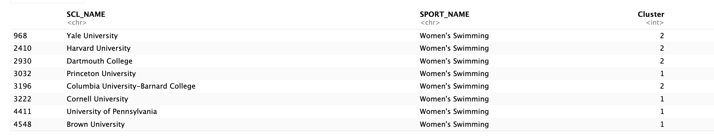

## 1. Principal Component Analysis (PCA)
  
- **PCA Output and Loadings Barplot**:

From the above PCA output and barplots, we can see that:
* PC1 is mostly influenced by academic variables such as `MULTIYR_APR_RATE_1000_OFFICIAL`, `MULTIYR_ELIG_RATE`, and `MULTIYR_RET_RATE`.
* PC2 is influenced by sport variables: `SPORT_CODE` and `Gender_Sport`
* PC3 is influenced by school demographics: `CONFNAME_19_numeric` and `SCL_HBCU_numeric`
* PC4 is influenced by team and school demographics: `MULTIYR_SQUAD_SIZE`, `CONFNAME_19_numeric`, `SCL_PRIVATE_numeric`

Because 4 principal components contribute to a large amount of the variance at 71.7%, we will choose to use 4 principal components for our analysis. 

---

## 2. K Means Clustering

### a. Finding the Right Number of Clusters

The Elbow Curve above shows that 2 clusters would be optimal for our analysis.

The CH Index plot shows a maximum at 1, indicating that 1 cluster would be optimal for our data.

The Gap Stat plot indicates that we should use 1 cluster for our analysis. 

### b. Testing Cluster Graphs

- **2 Clusters**:

- The plot above shows the 2 cluster k means solution. The clusters are well separated and distinct.

- **3 Clusters**:

- The plot above shows the 3 cluster k means solution. The clusters are almost equally well separated as the 2 cluster plot, and 3 clusters would give us more information. Therefore, we will use the 3 cluster plot for our analysis.

- The barplot above shows us the contributions of each variable to the cluster centers. A higher positive bar indicates a variable strongly influences that cluster, a low bar indicates little to no influence on that cluster, and a negative bar indicates that the variable is inversely related to that cluster.
- From the plot, we can see that academic variables highly influence all three clusters.
- Interestingly, we also see that gender influences cluster 3 (furthest left, lowest academic scores) positively, and influences cluster 1 (middle, middle academic scores), negatively. This could align with an observation (explained below) that men's sports seem to be, in general, further left on the graph (lower APR scores), and women's sports tend to be further right (higher APR scores). 

### c. Principal Components on Cluster Graphs

- **Dimension 1 Versus Dimension 3**:

- In the plot of principal component 1 versus principal component 3, we see more overlap in clusters than we did in the PC1 versus PC2 graph above. 

- **Dimension 1 Versus Dimension 4**:

In the above plot, we see that there is again more overlap in clusters than there was in the PC1 versus PC2 graph.

- **Dimension 2 Versus Dimension 3**:

In the PC2 versus PC3 plot above, we see the most overlap in clusters (vertical and horizontal overlap), which indicates that PC1 is the most informative in our clustering since this graph is the only one that does not include PC1 and it is has the least defined clusters. Because the graph of PC1 vs PC2 had the clearest clustering, we will use that for the rest of the analysis. 

### d. APR Scores in Each Cluster

As we can see above, the average APR scores for each cluster increase on the cluster graph from left to right, with cluster 3 (leftmost) having an average APR score of 973, cluster 1 (middle) having an average APR score of 986, and cluster 2 (right) having an average APR score of 999. From this, we can see that sports teams with higher academic standings are further right on the cluster graph, and sports teams with lower academic standings are further left on the graph. The clustering is highly influenced by academic success of the teams. 

The boxplot shows the distributions of APR scores in each cluster. There seems to be a difference between the clusters in terms of APR scores since the error bars don't overlap that much, however, it may not be significant. There are a few outliers much lower in APR score than the rest for cluster 3. I looked into the outliers and found that the lowest score and most obvious outlier belonged to the Men's Basketball team at Stephen F. Austin State University. Through a quick google search, I found that they have had recent issues with keeping their players eligible to play (by academic standards) and had to forfeit some of their recent conference titles due to an administrative error in certifying eligibility for their players. While this point is a significant outlier, some other sports at their school are not outliers in the data, so it does not make sense to take out the school entirely or even this point. However, it is something to note and may skew the graphs slightly. 

### e. Graphs by University and Sport

- **University of Alabama**:
  

For the University of Alabama, men's sports are further left on the graph (in clusters 3 and 1) than women's sports (clusters 1 and 2), which indicates that men's sports perform lower academically than women's sports, in general. There are only men's sports in cluster 3 (lowest academic performance). Also, women's sports are higher on the graph than men's sports since PC2 controls the height of the variables on the graph and PC2 is largely influenced by the gender variable. Baseball is the furthest left (lowest academic performance) and Women's Volleyball is the furthest right (highest academic performance) for this school. Only 4 of the sports appear in cluster 2 (furthest right, highest academic performance).
  
- **Stanford University**:
  

For the sports at Stanford University, we see a similar trend with only men's sports appearing in cluster 3 (lowest academic performance cluster), and women's sports appearing further right on the plot (higher academic performance). Among the highest academically performing teams are Women's water polo, women's golf, and women's field hockey (cluster 2). Again, Baseball is furthest left on the plot, with the lowest academic performance of this University (although, this is likely a coincidence, not enough evidence to call this a correlation even, just interesting to note). Among the lower academic scores are also men's gymnastics, men's swimming, and men's volleyball. In general, the sports appear closer together on the plot than those for the University of Alabama. There are 15 sports for Stanford that appear in cluster 2 (highest academic performance), which is far greater than the number of sports in cluster 2 for the University of Alabama.

- **Yale**:
  

For Yale University sports, we see the same trend with only men's sports appearing in cluster 3. The teams furthest right on the graph (best academics of the group) are women's volleyball and women's track/xc. The teams furthest left on the graph (lowest academic performance) are men's xc and men's golf. Although it doesn't look like it because clusters 1 and 2 overlap a bit, there are 17 teams in cluster 2 (highest academic performance), which is more than the 4 in cluster 2 from University of Alabama and than Stanford University. 

- **Notre Dame**:

Once again, we see that only men's sports appear in cluster 3. Some of the sports with the lowest academic performance (furthest left) are football, baseball, men's golf, and men's lacrosse. Some of the sports with the highest academic performance (in cluster 2) are women's track/xc, men's soccer, women's volleyball, men's tennis. Notre Dame has 13 sports in cluster 2. A lot of the sports also appear very close on the graph, which could indicate that various academic and demographic factors are similar for many sports at Notre Dame. 

- **UConn**:

We see the same trend with only men's teams being in cluster 3 for this graph. Some of the sports that are farthest left (lowest academics) include baseball, football, men's swimming, men's cross country, and men's basketball. The majority of the sports are in the middle in terms of academics, and are in cluster 1. Cluster 1 only contains women's sports. There are 5 sports in cluster 2 (high academic performance), which include men's basketball, men's tennis, men's ice hockey, men's golf, and women's tennis. There are more men's teams in the highest academic performance cluster than women's teams, which is interesting because the lowest academic cluster only consists of men's teams.

- **Women's Swim Ivies**:

For the women's swim teams at Ivy League schools, we see all of them in clusters 1 and 2 (middle and high academics). Yale, Harvard, Columbia, and Dartmouth are in cluster 2 (highest) and Princeton, Cornell, UPenn, and Brown are in cluster 1 (middle). There are no teams in cluster 3 (lowest academic scores), which aligns with what we might expect from an Ivy League sports team. Interestingly, the points are fairly spread out vertically, so there must be some demographic factor in PC2 contributing to this difference between the schools. 

- **Men's Swim Ivies**:

For the men's swim teams at Ivy League schools, on the graph they seem to be mostly in cluster 1 (middle), but when we check their cluster in the data, they are spread between clusters 3 and 2 (low and high academics). This difference is because when we look at cluster membership across multiple dimension, they appear in different clusters than if we just look at 2 dimensions, like in this graph. From the r output, we can see that Columbia, UPenn, and Brown are in cluster 2 (high academics), and the rest of the schools are in cluster 3 (low academics). 

## 3. Canonical Correlation Analysis

### a. CCA Plot

In the above plot, we see a strong correlation between all of the academic (x) variables (more red in color). In terms of the demographic variables (y), we see that `SPORT_CODE` and `Gender_Sport` are negatively correlated (blue). In the cross-correlation, `MULTIYR_RET_RATE` and  `SPORT_CODE` are positively correlated (orange), and `SCL_HBCU_numeric` and `MULTIYR_RET_RATE` seem slightly negatively correlated (blue). Otherwise, no variables seem to be significantly correlated from looking at the plot.

### b. Number of Covariates to Use

While from the graph it looks as if we should use 2 canonical covariates, since the elbow is at 2, when we do the wilks test for significance of the covariates, we find that we should use all 4 covariates since they all have significant p values (<0.05). 

### c. CCA Scatterplots

The scatterplots for the covariates are shown above. The top left is the scatterplot for u1 and v1, which seems to have a positive linear trend. The plot on the top right is u2 and v2, and seems to have a slightly positive linear trend/relationship. The bottom left plot is u3 and v3. It has a more random scatter, and does not seem to have a clear trend. Lastly, the bottom right plot is u4 and v4, and seems to have no linear trend and is grouped on the right of the plot. 

### d. CCA Influence

From the plots of the correlations between variables and canonical covariates above, we see that:
- `MULTIYR_APR_RATE_1000_OFFICIAL`, `MULTIYR_ELIG_RATE`, and `MULTIYR_RET_RATE` have the most influence on u1 (represented by the top left barplot in the top picture).
- `MULTIYR_APR_RATE_1000_OFFICIAL`, `MULTIYR_ELIG_RATE`, and `PUB_AWARD_20` have the most influence on u2 (top right plot in top picture).
- `MULTIYR_APR_RATE_1000_OFFICIAL` and  `MULTIYR_RET_RATE` have the most influence on u3 (bottom left plot in picture).
- `PUB_AWARD_20` has the most influence on u2 (bottom right graph in top picture).
- `SPORT_CODE`, `SCL_HBCU_numeric`, and `Gender_Sport` have the most influence on v1 (top left of bottom picture).
- `MULTIYR_SQUAD_SIZE` has the most influence on v2 (top right of the bottom picture).
- `SPORT_CODE` and `SCL_HBCU_numeric` have the most influence on v3 (bottom left of bottom picture).
- `SCL_PRIVATE_numeric` and `CONFNAME_19_numeric` have the most influence on v4 (bottom right of bottom picture)

### e. Overall Correlation Structure Between Variables

The diagram above shows the correlation structure between the variables and their canonical covariates, with the correlations from the output above labeled on the diagram. u1 and v1 are fairly positively correlated with a correlation of 0.5566, and u2 and v2 are slightly correlated with a correlation of 0.2702. u1 represents academic variables and v1 represents dempgraphic variables, and there seems to be correlations between the two sets of variables. 

## 4. Summary of Key Findings

1. **PCA**: PC1 was academic variables, PC2 was more influenced by sport, PC3 and 4 were demographics. PC1 had a large influence on the clustering. 
2. **K Means Clustering**: 3 clusters was most informative. The clusters were split by academic success.
3. **School Clusters**: Gender did seem to have an influence on academic success, with mens teams being less successful (an observation, not a significant conclusion). 
4. **CCA**: The academic and demographic variables were highly positively correlated. 

---

## 5. Limitations

1. **Few Demographic Variables**:
   - The dataset did not include that many demographic variables due to confidentiality of the players. We could have had a better idea of how demographic variables affect academics if there were more to choose from.
   
2. **Data Doesn't Include Every NCAA Division**:
   - We may have been able to see differences between sports teams more clearly if the schools differed more. It would be interesting to see this data for all three NCAA divisions rather than just Division I.

3. **Optimal Number of Clusters Not Clear**:
   - We used multiple graphs to try to find the optimal number of clusters, but there was not clear consensus, so th end result was a best guess at the optimal number based on the visualizations.

4. **The Variables Measured Very Similar Things**:
   - All of the academic variables measured very similar things, which is a good thing when we are trying to figure out which variables contribute most to the clustering, but could increase the risk of multicollinearity, which would negatively effect the k means clustering and PCA.
  
---

